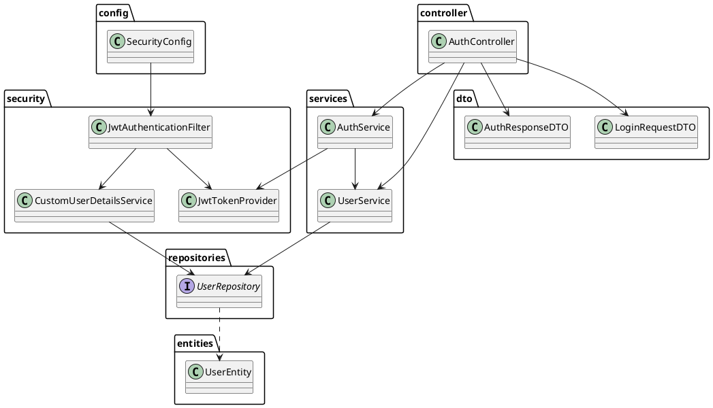

```plantuml
@startuml
package config{
    class SecurityConfig
}
package controller {
    class AuthController
}

package services {
    class AuthService
    class UserService
}

package repositories {
    interface UserRepository
}

package security {
    class JwtAuthenticationFilter
    class JwtTokenProvider
    class CustomUserDetailsService
}

package entities {
    class UserEntity
}

package dto {
    class LoginRequestDTO
    class AuthResponseDTO
}

AuthController --> AuthService
AuthController --> UserService
AuthController --> LoginRequestDTO
AuthController --> AuthResponseDTO
AuthService --> UserService
AuthService --> JwtTokenProvider
JwtAuthenticationFilter --> JwtTokenProvider
JwtAuthenticationFilter --> CustomUserDetailsService
UserRepository ..> UserEntity
UserService --> UserRepository
CustomUserDetailsService --> UserRepository
SecurityConfig --> JwtAuthenticationFilter

@enduml
```