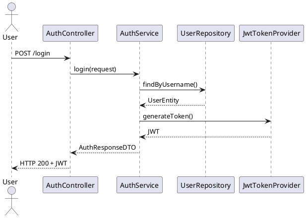

```plantuml
@startuml

actor User

participant AuthController
participant AuthService
participant UserRepository
participant JwtTokenProvider

User -> AuthController: POST /login

AuthController -> AuthService: login(request)

AuthService -> UserRepository: findByUsername()

UserRepository --> AuthService: UserEntity

AuthService -> JwtTokenProvider: generateToken()

JwtTokenProvider --> AuthService: JWT

AuthService --> AuthController: AuthResponseDTO

AuthController --> User: HTTP 200 + JWT

@enduml
```